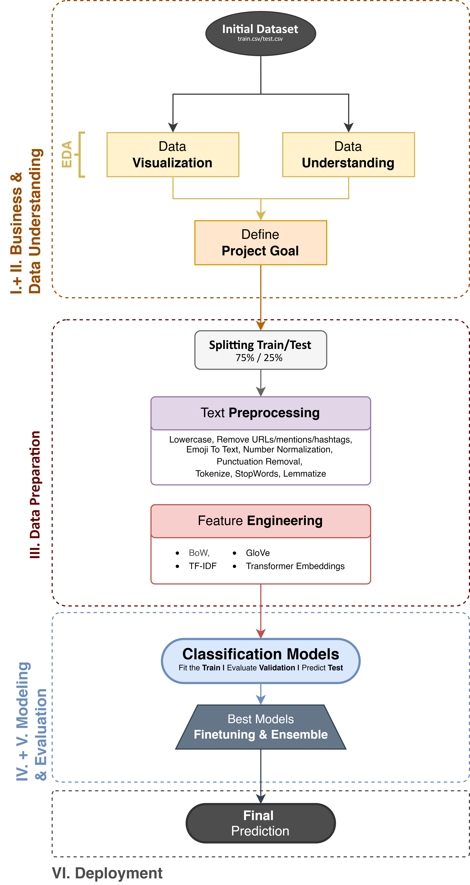
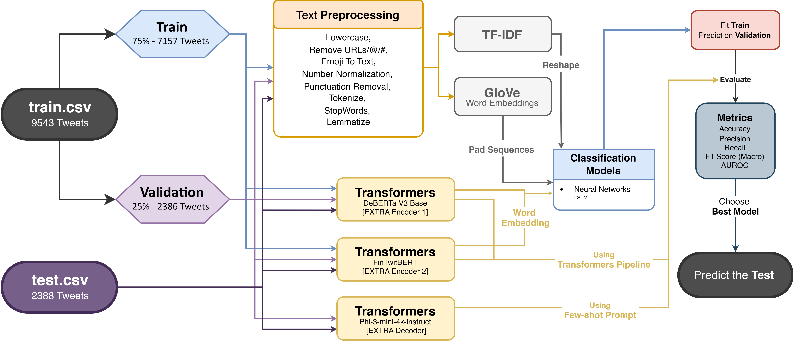
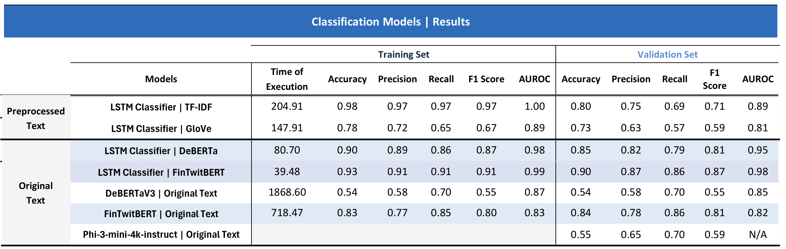
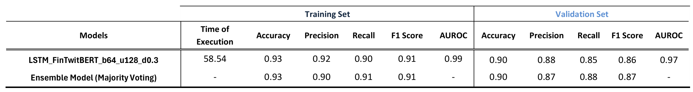

# 📈 Text Mining: Stock Market Sentiment Analysis from Tweets 🐦

    

    <!-- Project Links -->
    

## **📝 Description**

This project delves into the application of **Natural Language Processing (NLP)** for financial sentiment classification of tweets. Using a dataset of over 9,500 labeled tweets, the goal is to develop a robust system capable of classifying sentiment as **Bearish (sell)**, **Bullish (buy)**, or **Neutral**. The core of this work is a systematic comparison of traditional text representations (TF-IDF, GloVe) and state-of-the-art contextual embeddings (FinTwitBERT, DeBERTa), combined with classification models like LSTMs and Transformers, culminating in a robust ensemble model for maximum performance and generalization.

## **✨ Objective**

The primary objectives of this project are to:

-   **Implement a comprehensive preprocessing pipeline** to clean and normalize text from social media, handling elements like mentions, hashtags, and emojis.
-   **Experiment with and compare** various feature engineering techniques, from classic Bag-of-Words to advanced contextual embeddings from Transformer models.
-   **Develop and evaluate multiple classification models**, including Bidirectional LSTMs and various Transformer-based architectures (Encoders and Decoders).
-   **Identify the top-performing model** based on metrics suitable for imbalanced datasets, primarily **Macro F1-Score** and Accuracy.
-   **Construct a robust Ensemble Model** by combining predictions from the best individual models to enhance generalization on unseen data.

## **🎓 Project Context**

This project was developed for the **Text Mining** course as part of the **[Master's in Data Science and Advanced Analytics](https://www.novaims.unl.pt/en/education/programs/postgraduate-programs-and-master-degree-programs/master-degree-program-in-data-science-and-advanced-analytics-with-a-specialization-in-data-science/)** program at **NOVA IMS**. The work was completed during the **2nd Semester** of the 2024-2025 academic year.

## **🛠️ Technology Stack & Models**

This project was implemented entirely in **Python**, leveraging a powerful stack of libraries for NLP, deep learning, and data analysis.

    
    
     
    
    
    
    
     
    
    
    

## 🏗️ Project Methodology (CRISP-DM)

The project followed the **CRISP-DM** framework to ensure a structured approach, from problem definition to final evaluation and deployment.

    

<i><b>Figure 1:</b> Project Flowchart.</i>

### 1. Feature Engineering & Modeling

A multi-faceted approach was taken to convert raw tweet text into meaningful numerical representations and feed them into various model architectures.

1.  **Traditional Representations:**
    *   **TF-IDF:** Sparse vectors based on term frequency, using both unigrams and bigrams to capture some local context.
    *   **GloVe:** Pre-trained static word embeddings (`glove-twitter-200`) to capture semantic relationships learned from a large Twitter corpus.

2.  **Contextual Embeddings (Transformers):**
    *   **DeBERTa V3 Base:** A powerful, general-purpose Transformer used to generate high-quality contextual embeddings.
    *   **FinTwitBERT:** A BERT model pre-trained and fine-tuned on financial tweets, designed to understand the specific vocabulary and syntax of the financial domain.

3.  **Classification Architectures:**
    *   **Long Short-Term Memory (LSTM):** A Bidirectional LSTM network, effective for sequential data, was combined with each of the text feature sets.
    *   **Transformer Encoders:** Direct classification using the built-in heads of `FinTwitBERT` and `DeBERTa`.
    *   **Transformer Decoders (Extra):** An exploratory few-shot learning approach using the `Phi-3-mini-4k-instruct` model.

### 2. Evaluation Strategy

-   **Data Split:** The dataset was stratified and split into 75% for training and 25% for validation to ensure the class distribution was preserved.
-   **Performance Metrics:** **Macro F1-Score** was the primary metric to account for class imbalance, supported by **Accuracy**, **Precision**, and **Recall**.
-   **Model Selection:** The final model was selected based on validation set performance, followed by hyperparameter tuning of the most promising architecture.
-   **Final Solution (Ensemble):** To maximize robustness, a **Majority Voting Ensemble** was created from the top three performing models:
    1.  Tuned LSTM with FinTwitBERT embeddings.
    2.  The full FinTwitBERT Transformer pipeline.
    3.  LSTM with DeBERTa embeddings.

    

<i><b>Figure 2:</b> Modeling Process Flowchart.</i>

## 📊 Key Results & Conclusion

<i><b>Table 1:</b> Model Combinations Results.</i>

    

*   **Best Performing Model:** The combination of a **LSTM Classifier** with **FinTwitBERT embeddings** delivered the strongest individual performance, achieving a **Validation Accuracy of 90%** and a **Macro F1-Score of 0.87**.
*   **Superiority of Contextual Embeddings:** Domain-specific contextual embeddings (FinTwitBERT) significantly outperformed both traditional methods (TF-IDF, GloVe) and general-purpose embeddings (DeBERTa).
*   **Classifier vs. Direct Pipeline:** For this task, using Transformer embeddings as input to a downstream classifier (LSTM) proved more effective than using the Transformer's built-in classification head directly.
*   **Final Ensemble Model:** The ensemble model maintained the top-tier performance (90% Accuracy, 0.87 MF1-Score) while offering enhanced robustness by smoothing out individual model biases, leading to strong generalization on the final test set.

<i><b>Table 2:</b> Final Model Results.</i>

    

This project successfully highlights the potential of combining domain-adapted language models with deep learning architectures for fine-grained financial sentiment analysis, creating a powerful tool for market-aware NLP systems.

## 📂 Notebooks Structure

The project is documented and implemented across the following Jupyter Notebooks:

-   `tm_tests_37_01.ipynb`: Contains the full data exploration, preprocessing, and experimentation with all models and feature engineering techniques (except for the Decoder model since we needed to use a powerful GPU for it and it was only available in Google Colab).
-   `tm_tests_37_02.ipynb`: Focuses on the implementation of the Transformer Decoder model, using a few-shot learning approach with the `Phi-3-mini-4k-instruct` model.
-   `tm_final_37.ipynb`: Presents the final, ready-to-run pipeline, including the ensemble model implementation to generate predictions for the test dataset.

 

## 👥 Team Members (Group 37)

- **André Silvestre** (20240502)
- **Filipa Pereira** (20240509)
- **João Henriques** (20240499)
- **Umeima Mahomed** (20240543)